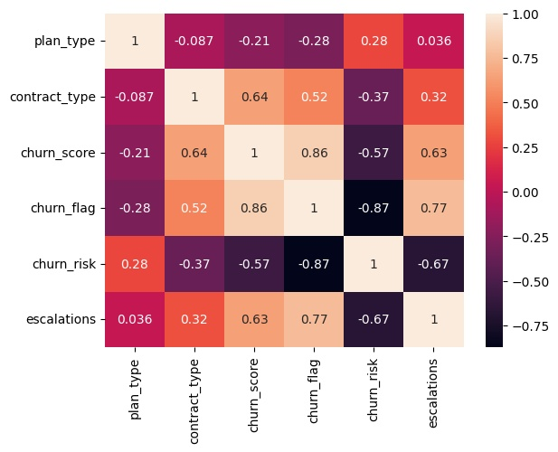

# 📊 Customer Churn Analysis & Customer Intelligence

An end-to-end Data Analytics project that analyzes customer churn using Python, SQL, and data visualization techniques. The project focuses on identifying churn patterns, customer behavior, revenue impact, and business insights through data cleaning, feature engineering, exploratory data analysis (EDA), and visualization.

---

## 📌 Project Overview

Customer churn is one of the most important business metrics for subscription-based companies. This project combines customer, subscription, and support data from a SQLite database to uncover the key factors influencing customer churn and provide actionable business insights.

---

## 🎯 Project Objectives

- Import data from a relational SQLite database
- Clean and preprocess raw data
- Merge multiple tables into a single analytical dataset
- Perform Feature Engineering
- Analyze customer churn and retention
- Create business KPIs
- Visualize customer behavior and churn trends

---

## 🛠️ Tech Stack

- Python
- SQL (SQLite)
- Pandas
- NumPy
- Matplotlib
- Seaborn
- Jupyter Notebook

---

## 📂 Dataset

The project uses three relational tables:

- 👤 Customer Data
- 💳 Subscription Data
- 🎧 Support Data

These tables are joined together to create a complete customer-level dataset.

---

## ⚙️ Project Workflow

### 1. Data Import
- Import data from SQLite database
- Load each table into Pandas DataFrames

### 2. Data Cleaning
- Rename columns
- Remove unnecessary columns
- Convert data types
- Standardize categorical values
- Handle missing values

### 3. Feature Engineering
- Create Churn Flag
- Calculate Customer Tenure
- Calculate Complaint Count
- Create Churn Risk categories
- Merge customer, subscription, and support datasets

### 4. Exploratory Data Analysis (EDA)
- Churn Rate
- Retention Rate
- Average Revenue Per User (ARPU)
- Revenue at Risk
- Average Customer Tenure
- Churn by Plan Type
- Complaint Analysis
- Escalation vs Churn Correlation

### 5. Data Visualization
- Monthly Churn Trend
- Churn by Plan Type
- Churn by State
- Correlation Heatmap
- Pair Plot
- Categorical Plot (Catplot)
- Pivot Tables

---

## 📊 Key KPIs

- Churn Rate
- Retention Rate
- ARPU
- Revenue at Risk
- Escalation Rate
- Average Complaints
- Customer Tenure
- Churn Risk
- Correlation

---

## 📈 Visualizations

- Line Chart
- Bar Chart
- Correlation Heatmap
- Pair Plot
- Catplot
- Pivot Tables

---

## 🔥 Correlation Heatmap

This heatmap shows the correlation between key customer churn variables.



## 📁 Project Structure

```
Customer-Churn-Analysis/
│
├── churn_analysis.ipynb
├── customer_churn.db
├── exported_churn_raw_data.csv
├── README.md
```

---

## 💼 Skills Demonstrated

- SQL
- Python
- Pandas
- NumPy
- Data Cleaning
- Data Wrangling
- Feature Engineering
- Exploratory Data Analysis (EDA)
- Business Intelligence
- Data Visualization
- Matplotlib
- Seaborn
- SQLite

---

## 📌 Business Insights


• Churn Rate: 28.6% | Retention Rate: 71.4%
• Most of the churn is from basic subscription plan – nothing to worry in terms of major revenue impact
• Most of the churn happened in the month of Sep 2024 and, most affected state is Karnataka
• Average Tenure (Days): 1,451 | ARPU is Rs 18.8
• Total Revenue = 395
• Revenue loss due to churn = 74 | CLTV Lost = 2,047
• % Revenue loss = 18%
• monthly vs annual churn = 55.6% vs 8.3%


---

## Business Recommendations

- Investigate the spike in customer churn in Karnataka by analyzing pricing changes, complaint trends, and technical issues.

- Review any pricing or product changes made to the Basic subscription plan, particularly during September, to assess their impact on churn.

- Analyze competitor offerings, as some customers cited switching to competitors as their reason for cancellation.

- Prioritize customers with **High** and **Medium** churn risk by considering their Customer Lifetime Value (CLTV).

- Contact high-value at-risk customers through email, SMS, or phone calls to resolve complaints and improve retention.

- Monitor customer satisfaction (CSAT) and complaint trends regularly to identify potential churn risks early.

 ---


## 🚀 Future Improvements

- Build an interactive Power BI Dashboard
- Develop a churn prediction model using Machine Learning
- Automate the data pipeline
- Deploy the project as an interactive web application

---

## ⭐ If you found this project useful, consider giving it a star!
