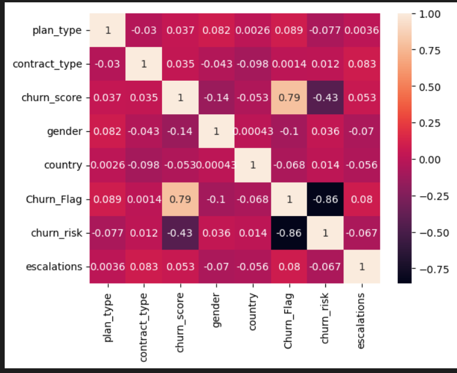

# 📊 Customer Churn Analysis & Customer Intelligence – Subscription Streaming Platform

## 📌 Project Overview

Customer retention is one of the biggest challenges for subscription-based businesses. This project analyzes customer churn for a subscription streaming platform to identify churn patterns, customer risk factors, revenue exposure, and potential retention opportunities.

The analysis combines **customer demographics, subscription information, and customer support interactions** using SQL and Python.

### Key Questions

- Who is churning?
- Which subscription plans have higher churn?
- How much revenue is at risk?
- What is the average customer tenure?
- Are support escalations related to churn?
- Which customers fall into high, medium, or low churn-risk categories?

---

## 🎯 Business Challenge

In a highly competitive OTT/subscription market, retaining existing customers is important for maintaining recurring revenue.

The objective of this project is to use customer and subscription data to:

- Measure overall churn and retention
- Identify high-risk customer segments
- Analyze churn across subscription plans
- Understand customer tenure and age
- Analyze customer support escalations
- Quantify revenue at risk due to churn
- Generate actionable insights for customer retention

---

## 🛠️ Tech Stack

### Programming & Data Analysis

- Python
- Pandas
- NumPy

### Database

- SQLite
- SQL

### Data Visualization

- Matplotlib
- Seaborn

### Environment & Tools

- Jupyter Notebook
- Git
- GitHub

---

## 🗂️ Dataset Structure

The project works with three relational tables.

### 1. Customer Table

Contains customer demographic information such as:

- Customer ID
- Name
- Date of Birth
- Gender
- State
- Country

### 2. Subscription Table

Contains subscription and revenue information:

- Customer ID
- Subscription Start Date
- Renewal Date
- Plan Type
- Contract Type
- Subscription Type
- Cancellation Date
- Cancellation Reason
- Monthly Charges
- CLTV
- Churn Score

### 3. Support Table

Contains customer support information:

- Customer ID
- Complaint Date
- Escalation Status
- CSAT Score
- Customer Comments

---

## 🔄 Project Workflow

```text
SQLite Database
      ↓
SQL Data Extraction
      ↓
Python + Pandas
      ↓
Data Cleaning
      ↓
Data Validation
      ↓
Feature Engineering
      ↓
Merge Relational Tables
      ↓
Churn & Revenue Analysis
      ↓
Statistical Analysis
      ↓
Matplotlib & Seaborn Visualizations
      ↓
Business Insights
```

---

## ⚙️ Project Implementation

### 1. Data Import

- Imported data from the SQLite database
- Connected SQLite with Python using `sqlite3`
- Loaded relational tables into Pandas DataFrames

### 2. Data Cleaning

- Renamed columns
- Removed unnecessary columns
- Converted data types
- Standardized categorical values
- Handled missing values
- Performed data-quality checks

### 3. Feature Engineering

Created additional features to support churn analysis:

- Churn Flag
- Customer Tenure
- Customer Age
- Complaint Count
- Churn Risk Categories
- Merged customer, subscription, and support datasets

### 4. Exploratory Data Analysis (EDA)

Analyzed:

- Churn Rate
- Retention Rate
- Average Revenue Per User (ARPU)
- Revenue at Risk
- Average Customer Tenure
- Churn by Plan Type
- Complaint Trends
- Support Escalations
- Escalation vs Churn Correlation

### 5. Data Visualization

Created visualizations using Matplotlib and Seaborn:

- Monthly Churn Trend
- Churn Rate by Plan Type
- Churn Rate by State
- Correlation Heatmap
- Pair Plot
- Categorical Plot (`Catplot`)
- Pivot Tables

---

## 📊 Key KPIs

| KPI | Value |
|---|---:|
| 📈 Churn Rate | **33.94%** |
| 💙 Retention Rate | **66.06%** |
| 💰 ARPU | **965.69** |
| ⚠️ Revenue at Risk | **72,769.97** |
| 📞 Escalation Rate | **25.79%** |
| 💬 Average Complaints | **0.44** |
| ⏳ Average Customer Tenure | **1,079 days** |

---

# 📊 Project Visualizations

---
## 📈 Yearly Churn Trend

This chart shows how customer churn changed over time and helps identify periods with higher customer attrition.


---

## 📊 Churn Rate by Plan Type

This visualization compares churn rates across different subscription plans and helps identify plans with higher customer attrition.


---

## 🗺️ Churn Rate by State

This visualization highlights customer churn across different states and helps identify regions with higher churn.


---

## 🔥 Correlation Heatmap

The correlation heatmap shows relationships between key variables used in the churn analysis.

Key observations include:

- **Churn Score** has a strong positive relationship with **Churn Flag (0.79)**.
- **Churn Risk** has a strong negative relationship with **Churn Flag (-0.86)**.
- **Escalations** show a very weak positive relationship with **Churn Flag (0.08)**.
- **Contract Type** shows almost no correlation with **Churn Flag (0.0014)**.
- The heatmap helps identify variables associated with customer churn.




---

## 💼 Skills Demonstrated

- SQL
- Python
- Pandas
- NumPy
- SQLite
- Data Cleaning
- Data Wrangling
- Feature Engineering
- Exploratory Data Analysis (EDA)
- Business Intelligence
- Data Visualization
- Matplotlib
- Seaborn
- Correlation Analysis
- Customer Segmentation
- KPI Analysis

---

## 💡 Business Insights

### 📊 Key Findings

📈 **Customer Churn Rate:** 33.94%  
💙 **Customer Retention Rate:** 66.06%  
💰 **Average Revenue Per User (ARPU):** 965.69  
⚠️ **Revenue at Risk:** 72,769.97 due to customer churn

### 🔎 Detailed Analysis

- 🔹 Compared churn across **Basic, Standard, and Premium** plans
- 🔹 Calculated **average customer tenure**
- 🔹 Analyzed **complaint and escalation trends**
- 🔹 Studied the relationship between **complaints, escalations, and churn** using correlation analysis

---

## 🎯 Business Recommendations

- Investigate the spike in customer churn in **Karnataka** by analyzing pricing changes, complaint trends, and technical issues.
- Review any pricing or product changes made to the **Basic subscription plan**, particularly during September, to assess their impact on churn.
- Analyze competitor offerings, as some customers cited **switching to competitors** as their reason for cancellation.
- Prioritize customers with **High** and **Medium** churn risk by considering their **Customer Lifetime Value (CLTV)**.
- Contact high-value at-risk customers through **email, SMS, or phone calls** to resolve complaints and improve retention.
- Monitor **customer satisfaction (CSAT)** and complaint trends regularly to identify potential churn risks early.

---

## 🚀 Future Improvements

- 📊 Build an interactive **Power BI Dashboard**
- 🤖 Develop a **Churn Prediction Model** using Machine Learning
- ⚙️ Automate the **data pipeline**
- 🌐 Deploy the project as an **interactive web application**

---

## 📁 Project Structure

```text
Churn-Analysis/
│
├── images/
│   ├── Monthly Churn Trend.jpg
│   ├── Churn Rate.jpg
│   ├── Churn Rate(Country).jpg
│   └── correlation_heatmap.jpg
│
├── Churn_Analysis_project.ipynb
├── customer_churn.db
├── README.md
└── requirements.txt
```

---

## ⭐ Support

If you found this project useful, consider giving the repository a ⭐ on GitHub!
